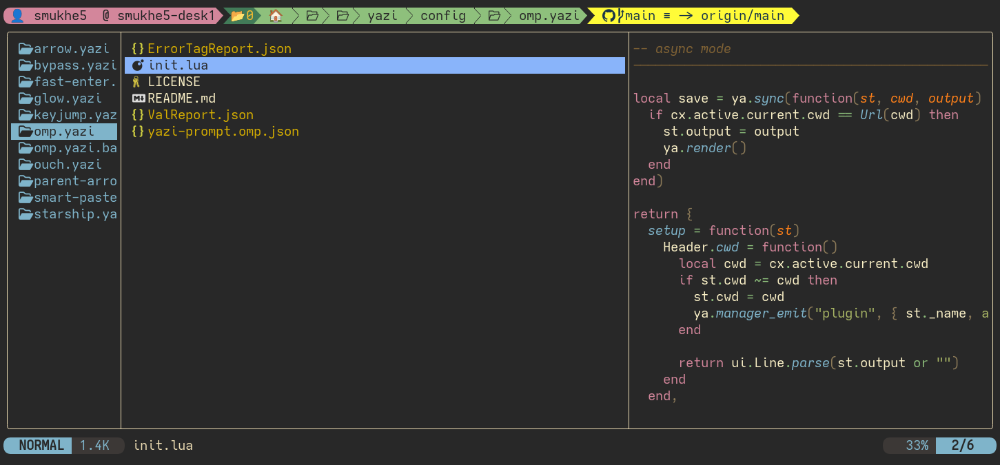

# omp.yazi

oh-my-posh prompt plugin for [Yazi](https://github.com/sxyazi/yazi) file manager.



## Requirements

- [Yazi](https://github.com/sxyazi/yazi) Need latest main branch code, Needs the latest commit.

## Installation

### Linux / MacOS

```sh
git clone https://github.com/saumyajyoti/omp.yazi.git ~/.config/yazi/plugins/omp.yazi
```

### Windows

```sh
git clone https://github.com/saumyajyoti/omp.yazi.git %AppData%\yazi\config\plugins\omp.yazi
```

## Usage

Add this to `~/.config/yazi/init.lua`:

```lua
require("omp"):setup()
```

Make sure you have https://github.com/jandedobbeleer/oh-my-posh installed and in your `PATH`.

## Extra

If you use a `oh-my-posh` theme with a background colour, it might look a bit to cramped on just the one line `Yazi` gives the header by default. You can add some space for the header by either using the [full border tip](https://yazi-rs.github.io/docs/tips/#full-border) from the `Yazi` docs, or add this slightly modified version (which won't add in the borders) to your `init.lua`:

<details>
<summary>Click to expand</summary>

```lua
function Manager:render(area)
    local chunks = self:layout(area)

    local bar = function(c, x, y)
        x, y = math.max(0, x), math.max(0, y)
        return ui.Bar(
            ui.Rect({
                x = x,
                y = y,
                w = ya.clamp(0, area.w - x, 1),
                h = math.min(1, area.h),
            }),
            ui.Bar.TOP
        ):symbol(c)
    end

    return ya.flat({
        ui.Bar(chunks[1], ui.Bar.RIGHT)
            :symbol(THEME.manager.border_symbol)
            :style(THEME.manager.border_style),
        ui.Bar(chunks[3], ui.Bar.LEFT)
            :symbol(THEME.manager.border_symbol)
            :style(THEME.manager.border_style),

        bar("┬", chunks[1].right - 1, chunks[1].y),
        bar("┴", chunks[1].right - 1, chunks[1].bottom - 1),
        bar("┬", chunks[2].right, chunks[2].y),
        bar("┴", chunks[2].right, chunks[1].bottom - 1),

        -- Parent
        Parent:render(chunks[1]:padding(ui.Padding.xy(1))),
        -- Current
        Current:render(chunks[2]:padding(ui.Padding.y(1))),
        -- Preview
        Preview:render(chunks[3]:padding(ui.Padding.xy(1))),
    })
end
```

</details>

> [!NOTE]
> This works by overriding your `Manager:render` function so make sure this is the only place you're doing that in your config

## Acknowledgements

- [sxyazi](https://github.com/sxyazi) for providing the code for this plugin.
